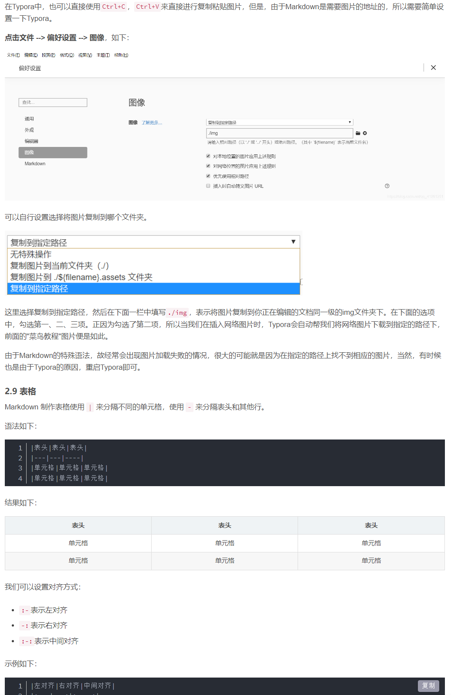

# Typora语法详解

[toc]

## 一、标题

**1.\# [一级标题]**

> # 一级标题

**2.\## [二级标题]**

> ## 二级标题

最多到六级，也可以用Ctrl+1（2，3，……，6）来表示，Ctrl+0 表示段落

## 二、字体

**1.斜体：**

​	\*文本\*  

​	\_文本\_

​    Ctrl+i

> *文本*

**2.粗体：**

​	\*\*文本\*\*

​	\_\_文本\_\_

 Ctrl+b

> **文本**

## 三、线

**1.分割线** 

\+\+\+

\***

\---

> +++

**2.删除线**

\~~文本~~

Alt+Shift+5

> ~~文本~~

**3.下划线**

\<u>文本\</u>

Ctrl+U

> <u>文本</u>

## 四、列表

**1.无序列表**

\* [文本]

\+ [文本]

\- [文本]

> * 文本

**2.有序列表**

[数字]. [文本]

> 1. 文本
> 2. 文本

数字并不重要

**3.嵌套列表**

\* 一级 （回车）

TAB \* 二级  （回车）

TAB TAB \* 三级

> * 一级
>   * 二级
>     * 三级
>       * 四级

按TAB进入下一级，按回车回到上一级

**4.无序列表和有序列表互相嵌套**

1. 一级有序
2. 一级有序
   1. 二级有序
      * 三级无序
        * 四级无序
          1. 五级有序
          2. 五级有序

## 五、区块

\> 文本

> 文本

区块嵌套

> 1
>
> > 2
> >
> > > 3

## 六、代码

**1.一行代码** 

\`代码`

> `代码`

**2.代码段**

\```

代码

> ```代码
> 代码
> ```

## 七、链接

**1.链接网页**

[链接文字]\(链接地址\)   用英文括号

\<链接地址\>

> [百度](https://www.baidu.com)
>
> <https://www.baidu.com>

**2.链接本地文件**

> [hello-world.md](./hello-world.md)

**3.页内跳转**

> [调转到标题](##一、标题)

## 八、图片

**1.\!\[alt 属性文本\]\(图片地址\)**

> 

**2.\!\[alt 属性文本]\(图片地址 "可选标题"\)**

> 

**3.直接粘贴复制图片**



## 九、表格

**1.Markdown 制作表格使用`|`来分隔不同的单元格，使用`-`来分隔表头和其他行。**

\|表头|表头|表头|
|---|---|----|
|单元格|单元格|单元格|
|单元格|单元格|单元格|

>| 表头   | 表头   | 表头   |
>| ------ | ------ | ------ |
>| 单元格 | 单元格 | 单元格 |
>| 单元格 | 单元格 | 单元格 |

**2.设置对其方式**

\|左对齐|右对齐|中间对齐|
|:---|---:|:----:|
|单元格|单元格|单元格|
|单元格|单元格|单元格|

>| 左对齐 | 右对齐 | 中间对齐 |
>| :----- | -----: | :------: |
>| 单元格 | 单元格 |  单元格  |
>| 单元格 | 单元格 |  单元格  |

## 十、Typora与HTML

**1.字体颜色与大小**

\<font size=3 color="red">字体颜色为红色，大小为3</font>

\<font size=4 color="blue">字体颜色为蓝色，大小为4</font>

\<font size=6 color="violet">字体颜色为紫罗兰，大小为6</font>

><font size=3 color="red">字体颜色为红色，大小为3</font>

> <font size=4 color="blue">字体颜色为蓝色，大小为4</font>

> <font size=6 color="violet">字体颜色为紫罗兰，大小为6</font>

**2.对齐方式**

\<p align="left">左对齐</p>

\<p align="center">中间对齐</p>

\<p align="right">右对齐</p>

><p align="left">左对齐</p>
><p align="center">中间对齐</p>
><p align="right">右对齐</p>

**3.插入图像**

\


**4.改变图像大小**

\


**5.改变图片的位置**

\图片在左边
\图片在右边

图片在左边
图片在右边

## 扩展用法

**1.emoji表情**

\:happy:    :happy:

\:crab:    :crab:

\:horse:     :horse:

**2.插入目录**

\[toc]

**3.文本高亮**

\==文本==

==文本==

这个功能可在偏好设置 --> Markdown扩展语法中设置。

**4.上下标**

H\~2\~O表示H~2~O

X\^2\^表示X^2^


参考文献：[最齐的Typora使用教程](https://blog.csdn.net/qq_41261251/article/details/102817673?ops_request_misc=%257B%2522request%255Fid%2522%253A%2522168592792616800182137679%2522%252C%2522scm%2522%253A%252220140713.130102334..%2522%257D&request_id=168592792616800182137679&biz_id=0&utm_medium=distribute.pc_search_result.none-task-blog-2~all~top_positive~default-1-102817673-null-null.142^v88^control_2,239^v2^insert_chatgpt&utm_term=Typora&spm=1018.2226.3001.4187)

